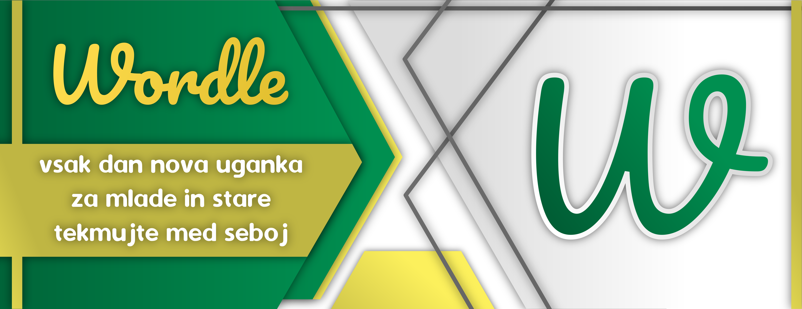

# Wordle
> Preprosta miselna igra, kjer se vsak dan išče beseda dvena. Na dan dobite 6 poskusov, v katerih jo morate najti.

## Demo igra
Igro lahko poskusite na [!tej povezavi](http://aleks.rf.gd/wordle/).

## Kako se igra?
- Vnesi 5 mestno slovensko besedo :pencil2:.
- Če se med tipkanjem zmotiš, pritisni gumb :arrow_left: da pobrišeš črko.
- Ko si vnesel želeno besedo, jo potrdi s klikom na gumb :ballot_box_with_check:.
Beseda se obarva, če obstaja v [Slovaru slovenskega knjižnega jezika](https://www.fran.si/) oz. hitro strese, če je ni v slovarju.
- Rezultat se primerno obarva spodaj.

## Barvna shema
- Če je črka **zelene barve**, je na pravem mestu v besedil. :smiley:
- Če je črka **rumene barve**, se nahaja v besedi, ampak ni na pravem mestu. :thinking:
- Če je črka **sive barve**, je ni nikjer v besedi. :confounded:
